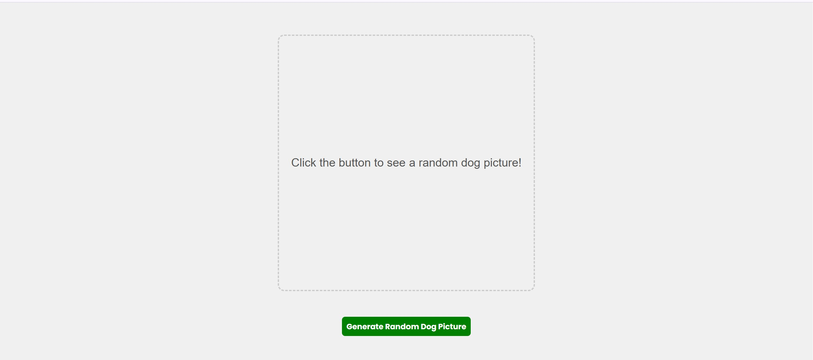

# 🐶 Random Dog Image Generator

A fun little web app that fetches and displays random dog pictures using the Dog CEO API. Perfect for beginners learning JavaScript fetch API and responsive design.

## Features

- Random image on button click
- Responsive layout with media queries
- Clean HTML/CSS/JS structure

## Tech Stack

- HTML
- CSS (with media queries)
- JavaScript (async/await + fetch)

## Live Demo

[👉 Click here to try it out](https://sushant-bit.github.io/random-dog-image-generator/)

## API Used

- [Dog CEO's Dog API](https://dog.ceo/dog-api/)

## Screenshot

## License

MIT
